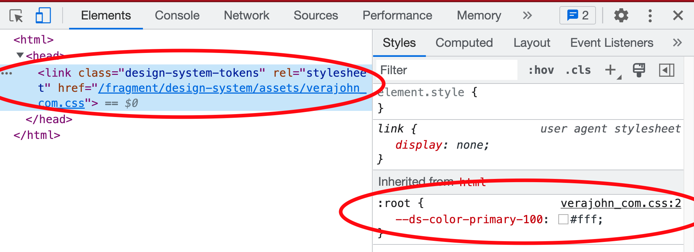

# Development Guide - Tokens

Design tokens are name and value pairings that represent small, repeatable design decisions.
We can represent it as a CSS variable `--spk-color-primary-100` in terms of code representation.

More Definition can be found here: 
* https://confluence.gamesys.co.uk/display/GSYSDEV/Design+System+~+Design+Tokens

## [Requirements](#requirements)

* `Node` >=18.0.0 <19.0.0
* `npm` >=8.0.0 <10.0.0
* `Docker Engine` using `Rancher Desktop`
    * Setup guide can be found here: https://rtfm.gitpages.enjoy-platform.net/help/docker-to-rancher/

## [Supported Themes](#supported-themes)
These are all themes supported by the design tokens.
* `INTERCASINO_COM`
* `INTERCASINO_JP`
* `INTERCASINO_SE`
* `VERAJOHN_COM`
* `VERAJOHN_JP`
* `VERAJOHN_SE`
* `YUUGADO_COM`
* `BOABET`
* `HAPPYLUKE_COM`
* `LIVECASINOHOUSE_COM`

## [Running Design Tokens Locally](#running-design-tokens-locally)
### [Complete Setup Run](#complete-setup-run)
1. Goto tokens folder
   ```bash
   cd ./platform/tokens
   ```
2. Install necessary packages
   ```bash
   npm ci
   ```
3. Build all CSS files
   ```bash
   npm run build:dev
   ```
4. Create docker network
   ```bash
   docker network create -d bridge environment_default
   ```
5. Goto platform folder
   ```bash
   cd ../
   ```
6. Run the server
   ```bash
   npm run start
   ```
7. Once you run the server, the expected output should be:
   ```
   [INFO] Successfully generated nginx configuration file at: "/Users/eric.nilo/Projects/design-system-fragment/docker/nginx/conf.d"
   [+] Running 1/0
   ⠿ Container docker-nginx-1  Created                                                                                         0.0s
   Attaching to docker-nginx-1
   docker-nginx-1  | /docker-entrypoint.sh: /docker-entrypoint.d/ is not empty, will attempt to perform configuration
   docker-nginx-1  | /docker-entrypoint.sh: Looking for shell scripts in /docker-entrypoint.d/
   docker-nginx-1  | /docker-entrypoint.sh: Launching /docker-entrypoint.d/10-listen-on-ipv6-by-default.sh
   docker-nginx-1  | 10-listen-on-ipv6-by-default.sh: info: /etc/nginx/conf.d/default.conf is not a file or does not exist
   docker-nginx-1  | /docker-entrypoint.sh: Launching /docker-entrypoint.d/20-envsubst-on-templates.sh
   docker-nginx-1  | /docker-entrypoint.sh: Launching /docker-entrypoint.d/30-tune-worker-processes.sh
   docker-nginx-1  | /docker-entrypoint.sh: Configuration complete; ready for start up
   ```
8. Visit the http://localhost:8085/tokens?theme=VERAJOHN_COM
   * see the list of all supported themes [here](#supported-themes)
9. Inspect the browser page, then locate the highlighted.
   * Note: All the highlighted items must be there
   * 


### [Subsequent Run](#subsequent-run)

Commands below are mostly used once you are developing under `tokens`

**NOTE**: Make sure you are under `./platform/tokens` when executing below commands

1. Build all CSS files using watch
   ```bash
   npm run build:watch
   ```
2. Goto platform folder
   ```bash
   cd ../
   ```
3. Run the server
   ```bash
   npm run start
   ```
4. Visit the http://localhost:8085/tokens?theme=VERAJOHN_COM
    * see the list of all supported themes [here](#supported-themes)
5. Inspect the browser page, then locate the highlighted.
    * Note: All the highlighted items must be there
    * 

## WIP: Manually creating a new set of Design Tokens
Let's give an example scenario:

There's a new component called `component name here` and we are introducing these tokens:
* *list tokens here*
1. *instructions here*
